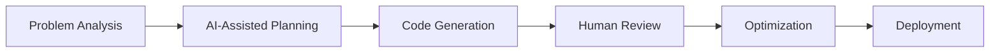

# 🚀 Dennis
### Full-Stack AI-Enhanced Developer


> Leveraging AI to amplify development capabilities across multiple languages and platforms

## 🧠 About Me
```javascript
const dennis = {
    role: "AI-Augmented Developer",
    languages: ["Python", "JavaScript", "Java", "C++", "Ruby", "Go"],
    aiTools: ["ChatGPT", "GitHub Copilot", "Claude", "Bard"],
    passions: ["AI Integration", "Clean Code", "Innovation"]
};
```

## 🛠️ Tech Stack

### Programming Languages
<div align="left">
  
  
  
  
  
  
  
</div>

### AI Development Tools
<div align="left">
  
  
  
  
</div>

### Frameworks & Tools
<div align="left">
  
  
  
  
  
  
</div>

## 📊 GitHub Analytics

<h2 align="center">📊 My Github Stats<h2>
<div>
  
  
<div>
  </br>

## 🔥 Contribution Streak

[](https://git.io/streak-stats)

## 🌟 Featured Projects

### AI-Enhanced Applications
<div align="left">
  <a href="#">
    
  </a>
  <a href="#">
    
  </a>
</div>

## 💡 AI Development Workflow


## 🤝 Connect With Me
<div align="left">
  <a href="your-linkedin-url">
    
  </a>
  <a href="your-github-url">
    
  </a>
  <a href="mailto:your-email">
    
  </a>
</div>

---
<div align="center">
  
</div>
